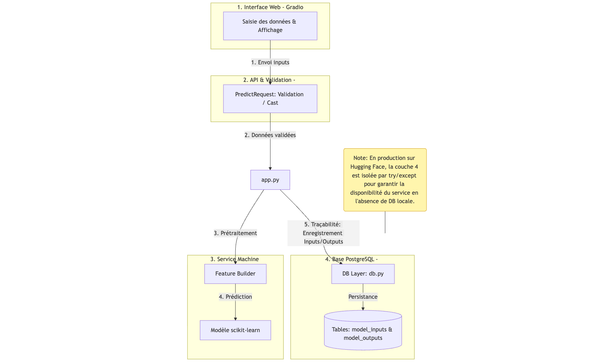

# API de prédiction — Modèle de Machine Learning

> Objectif : Ce projet est réalisé dans le cadre du Projet 5 de la formation AI Engineer. L’objectif est de mettre en place et déployer un modèle de machine learning. C'est également une première approche pour maitriser le système de gestion de versions avec Git et GitHub.

## Vue d’ensemble
Ce projet est réalisé dans le cadre du **Projet 5 de la formation AI Engineer**.  
Il a pour objectif de **déployer un modèle de Machine Learning** au sein d’une application fonctionnelle, testée, documentée et intégrée dans un pipeline CI/CD.

Le projet couvre :
- la mise en place du modèle et de son pipeline de prédiction,
- la validation des entrées et sorties,
- la mise en œuvre de tests unitaires et fonctionnels,
- l’automatisation des tests via une intégration continue,
- la documentation technique et fonctionnelle du projet.

## Objectifs pédagogiques

- Déployer un modèle de Machine Learning dans une application exploitable
- Garantir la fiabilité du code via des tests unitaires et fonctionnels
- Mettre en place un pipeline CI/CD automatisé
- Documenter l’API, le modèle et l’architecture du projet
- Respecter les bonnes pratiques de versioning avec Git et GitHub

---

## Fonctionnalités
- **Prédiction** : saisie des données via l’interface Gradio et retour d’une prédiction
- **Validation d’entrée/sortie** : schémas (ex. Pydantic) + contraintes de base.
- **Pipeline de transformation des données** cohérent avec l’entraînement du modèle
- **Calcul de probabilités associées à la prédiction**
- **Interface utilisateur** via Gradio
- **Exécution automatisée des tests** via GitHub Actions
- **Déploiement** : conteneurisation via Docker.


---

## Stack technique
- **Langage** : Python  
- **Machine Learning** : scikit-learn  
- **Validation des données** : Pydantic  
- **Interface applicative** : Gradio  
- **Base de données** : PostgreSQL (local, optionnelle en CI)  
- **Tests** : Pytest, Pytest-cov  
- **CI/CD** : GitHub Actions  

---

## Architecture (vue simple)

```bash
projet-5-modele-machine-learning/
├── docs/                      # Documentation technique (MkDocs)
│   ├── index.md
│   ├── architecture.md
│   ├── pipeline.md
│   └── tests.md
├── mkdocs.yml                 # Configuration MkDocs
├── src/
│   └── projet5/
│       ├── db/                # Accès base de données
│       ├── model/             # Logique métier et ML
│       └── utils/             # Fonctions utilitaires
├── models/
│   └── model.joblib           # Modèle entraîné
├── tests/
│   ├── test_features.py
│   ├── test_validation.py
├── ├── test_functional_predict.py
│   └── test_sanity.py
├── notebooks/                 # Exploration et entraînement
├── requirements.txt
├── .github/workflows/ci.yml   # Pipeline CI
└── README.md
```

---

## Architecture globale 

L’application est structurée en 4 couches :

- **Interface Web (Gradio)** : saisie des données utilisateur et affichage des prédictions  
- **API & Validation (Pydantic)** : validation, typage et sécurisation des inputs  
- **Service Machine Learning** : construction des features et prédiction via le modèle scikit-learn  
- **Base PostgreSQL** : persistance des entrées et sorties pour assurer la traçabilité des prédictions  




### Traçabilité et persistance des données

À chaque appel de prédiction, les inputs et les outputs sont persistés en base de données afin d’assurer la traçabilité.

**Base de données PostgreSQL :**
- **Tables :** `model_inputs`, `model_outputs`
- **Contenu :** paramètres d’entrée utilisateur, prédiction, probabilité associée


## Pipeline de traitement (logique)
1. L’utilisateur saisit les données via l’interface Gradio.
2. Les données sont validées à l’aide de schémas Pydantic.
3. Les features sont construites conformément au pipeline d’entraînement.
4. Le modèle de Machine Learning génère une prédiction.
5. Une probabilité associée est calculée.
6. Le résultat est renvoyé à l’utilisateur sous forme structurée.
---

## Installation

```bash
git clone <url-du-repo>
cd projet-5-modele-machine-learning
python -m venv .venv
source .venv/bin/activate
pip install -r requirements.txt
```

---

## Lancement de l'application

```bash
python app.py
```

L’interface Gradio est accessible à l’adresse :  
http://127.0.0.1:7860

---


## Faire une prédiction
Données attendues : 
- age
- genre
- revenu mensuel 
- ancienneté dans l'entreprise
- niveau de satisfaction


Exemple de réponse :
{
  "prediction": false,
  "prediction_proba": 0.0003,
  "model_input_id": 12
}

---

## Tests
Des tests unitaires et fonctionnels sont implémentés afin de garantir la fiabilité du modèle et du pipeline :
- validation des entrées avec Pydantic
- vérification de la construction des features
- tests des cas limites et scénarios d’erreur
- tests fonctionnels du pipeline complet de prédiction

Exécution des tests :
```bash
pytest -v
pytest --cov
```

## Rapport de couverture
Un rapport de couverture de tests est généré à l’aide de pytest-cov :

```bash
pytest --cov=. --cov-report=term-missing --cov-report=html
```

Cette commande produit :
- un résumé de la couverture directement dans le terminal,
- un rapport HTML détaillé généré dans le dossier htmlcov/.
Le rapport HTML permet d’identifier précisément les parties du code couvertes par les tests ainsi que les zones restant à renforcer.

---

## Intégration continue (CI/CD)
Un pipeline CI/CD est configuré via GitHub Actions afin d’installer les dépendances, exécuter les tests et garantir la stabilité du projet à chaque push et pull request.

### Déploiement sur Hugging Face Spaces

L’application est déployée sur Hugging Face Spaces :  
👉 https://huggingface.co/spaces/Emilie7/projet-5-modele-ml

Chaque push sur la branche `main` déclenche automatiquement :
- l’installation des dépendances
- l’exécution du pipeline CI
- le déploiement en production

Les variables sensibles sont stockées via Hugging Face Secrets.

---

## Sécurité et gestion des secrets
**Variables d'environnement utilisées :** `DB_USER`, `DB_PASSWORD`, `DB_HOST`, `DB_PORT`, `DB_NAME`.
- Les secrets (tokens, identifiants) sont stockés exclusivement via les variables d’environnement et les secrets GitHub Actions.
- Aucun secret sensible n’est versionné dans le dépôt Git.
- Les fichiers `.env` sont ignorés via `.gitignore`.
- Les entrées utilisateurs sont validées via des schémas Pydantic afin de limiter les risques liés aux données invalides.
- Les environnements de développement et de CI sont clairement séparés.

---
## Conteneurisation avec Docker
Le projet est conteneurisé à l’aide de Docker afin de standardiser l’environnement d’exécution et faciliter le déploiement.

```bash
docker build -t projet5-ml .
docker run -p 7860:7860 projet5-ml
```

L’application est accessible à l’adresse :
http://localhost:7860

---
## Documentation

### Documentation de l’API
L’API expose une documentation intégrée via l’interface Gradio.
Les schémas de données, contraintes et validations sont définis à l’aide de Pydantic, ce qui garantit la cohérence des entrées et sorties.

### Documentation technique du projet
Une documentation technique est rédigée à l’aide de **MkDocs**.

Elle présente :
- l’architecture générale du projet,
- le pipeline de traitement et de prédiction,
- le modèle de machine learning,
- les choix techniques réalisés,
- les pistes d’amélioration et de maintenance.

### Lancer la documentation en local

```bash
mkdocs serve
La documentation est alors accessible à l’adresse indiquée dans le terminal (par défaut : http://127.0.0.1:8000).
```

---
## Choix techniques et limites
- Gradio a été choisi pour sa simplicité et sa rapidité de mise en œuvre.
- Le modèle embarqué est figé et n’est pas réentraîné automatiquement.
- Les tests en CI n’utilisent pas la base PostgreSQL afin de garantir leur stabilité.
- Les performances du modèle dépendent du jeu de données utilisé lors de l’entraînement.

---
## Améliorations possibles
- Tests d’intégration complets avec base de données mockée
- Exposition du modèle via une API FastAPI
- Monitoring des prédictions
- Réentraînement automatique du modèle

---
## Contact
Émilie Moissette
Formation AI Engineer


